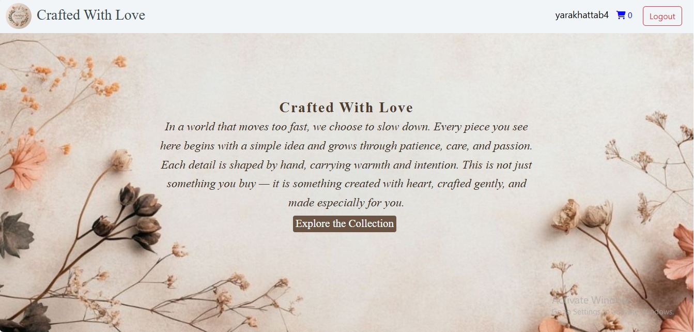
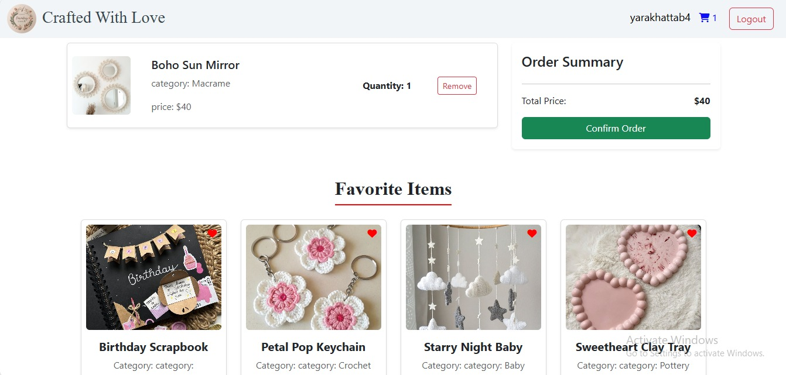

##  Crafted With Love - Handmade E-Commerce Platform

**Crafted With Love** is a high-performance, responsive e-commerce web application designed for selling unique handmade gifts. This project demonstrates advanced DOM manipulation, state management using LocalStorage, and a seamless user experience (UX) from browsing to checkout.

---

## 🌟 Key Features

### 🛒 Dynamic Shopping Cart
* **Real-time Updates:** Add or remove items with instant feedback.
* **Quantity Control:** Increase or decrease product quantities directly in the cart.
* **Persistent Storage:** Your cart is saved in `localStorage`, so you never lose your items even after a refresh.

### ❤️ Smart Favorites System
* **Persistence:** Favorite items are saved across pages.
* **Interactive UI:** The heart icon toggles its state (solid/regular) based on the data stored in the user's profile.
* **Separate Wishlist:** A dedicated section to view and manage all your loved products.

### 🔍 Advanced Search & Filter
* **Dual-Mode Search:** Search for products by **Name** or **Category**.
* **Instant Results:** User-friendly filtering to find the perfect gift quickly.

### 🔐 User Authentication
* **Custom Login/Register:** Secure user flow that unlocks personalized features like the cart and wishlist.
* **Session Management:** Displays the username and provides a logout functionality.

---

## 🛠️ Tech Stack

* **Frontend:** HTML5, CSS3 (Custom Styling)
* **Framework:** Bootstrap 5 (Responsive Layouts)
* **Scripting:** Vanilla JavaScript (ES6+)
* **Icons:** FontAwesome 6
* **Typography:** Google Fonts (Abril Fatface, Cormorant Garamond)

---

## 🛠️ Technical Highlights

* **State Management:** Used `localStorage` to sync data across all pages.
* **Dynamic Rendering:** Generated UI components dynamically using JavaScript ES6+.
* **Responsive Design:** Fully responsive layout built with **Bootstrap 5** and custom CSS.
* **Logic & CRUD:** Implemented Create, Read, and Delete operations for both the Cart and Wishlist.
  
---

## 📸 Project Preview

| Home Page | Favorites Page |
| :---: | :---: |
|  |  |ps://via.placeholder.com/500x300?text=Home+Page+Preview) |  |

---
## 🚀 Getting Started

 **Visit the Repository:**
   [View Crafted With Love](https://yara-khattab.github.io/Crafted-With-Love/)
---

## 📜 Personal Touch
> "Behind every careful detail... there was a quiet strength."
This project is dedicated to the beauty of handmade crafts and the patience required to build something from scratch—both in art and in code.

**Developed with ❤️ by [Yara Khattab]**
